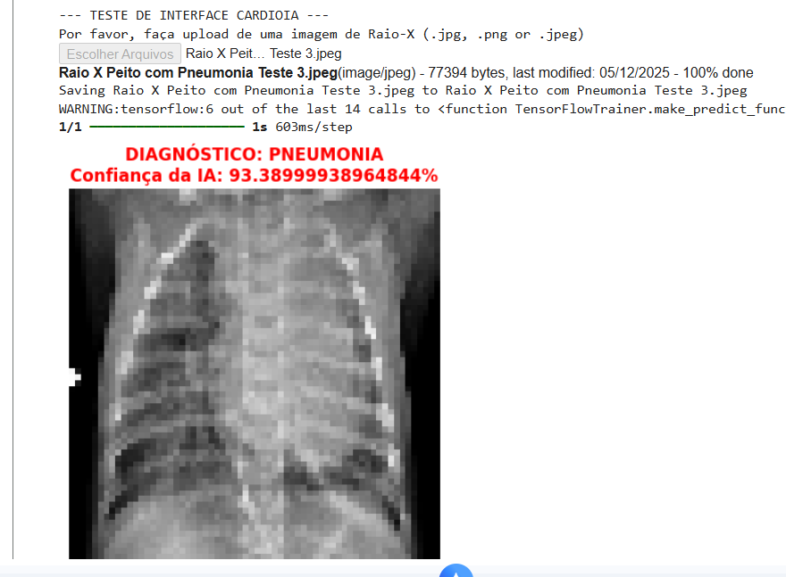
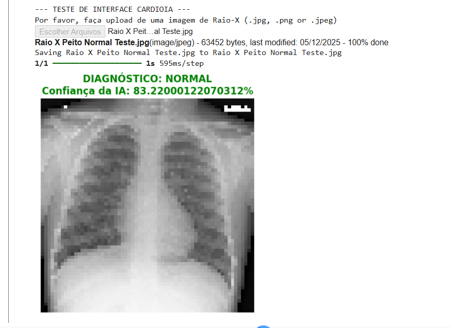
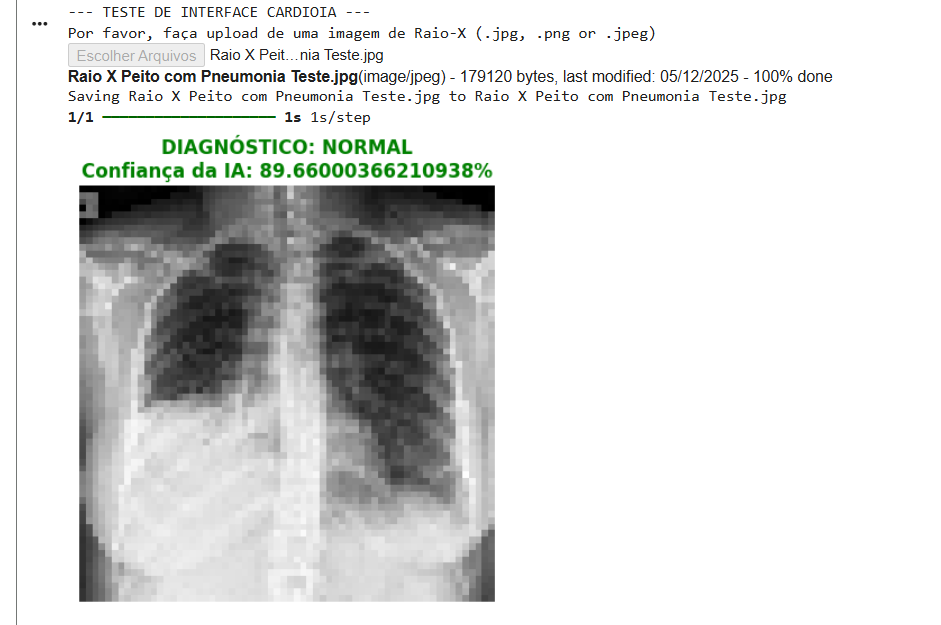

# FIAP - Faculdade de Informática e Administração Paulista

<p align="center">
  <a href="https://www.fiap.com.br/">
    
  </a>
</p>

<br>


## Grupo 40

## 👨‍🎓 Integrantes: 
- <a href="https://www.linkedin.com/in/vittor-augusto/">Vitor Augusto Gomes</a>
- <a href="https://www.linkedin.com/in/jo%C3%A3o-vitor-lopes-beiro-59a007248/">João Vitor Lopes Beiro</a>

## 👩‍🏫 Professores:
### Tutor(a) 
- <a href="https://www.linkedin.com/in/leonardoorabona/">Leonardo Ruiz Orabona</a>
### Coordenador(a)
- <a href="https://www.linkedin.com/in/profandregodoi/">André Godoi Chiovato</a>


## 📜 Descrição

# 🫁 CardioIA - Fase 4: Visão Computacional para Apoio ao Diagnóstico


## 📌 Sobre o Projeto

A **CardioIA** avança para a Fase 4, focada na aplicação de **Visão Computacional** e **Deep Learning** para análise de imagens médicas. 

O objetivo deste protótipo é atuar como um **Assistente Cardiológico Virtual**, capaz de processar exames de Raio-X de tórax e classificar, com alta confiabilidade, a presença de **Pneumonia** ou condições **Normais** utilizando técnicas de Deep Learning (CNNs e Transfer Learning). Esta solução visa auxiliar a tomada de decisão clínica (CDSS), priorizando a eficiência na triagem de pacientes.

Dando continuidade à fase anterior de monitoramento contínuo, a **CardioIA** avança agora para a **Fase 4: Análise Visual**. O desafio é transformar imagens médicas brutas em informações interpretáveis para auxílio à tomada de decisão clínica.

---

## 👥 Colaboração e Organização da Equipe

Este projeto foi desenvolvido adotando metodologias ágeis e divisão interdisciplinar de tarefas, simulando um ambiente real de HealthTech. A equipe foi estruturada para cobrir as frentes de Engenharia de Dados e Ciência de Dados.

| Integrante |
| :--- |
| **[Vitor Augusto Gomes]** • Configuração do ambiente e API do Kaggle.<br>• Pipeline de ETL: Aquisição, limpeza e pré-processamento.<br>• Implementação de Data Augmentation.<br>• Desenvolvimento do Modelo Baseline (CNN do Zero). |
| **[João Vitor Lopes Beiro]** • Implementação de Transfer Learning (VGG16).<br>• Otimização de hiperparâmetros e análise de métricas (Recall/F1).<br>• Desenvolvimento da interface interativa (Protótipo).<br>• Documentação técnica e análise de erros. |

> *A colaboração e comunicação constante foram essenciais para integrar o pipeline de dados com a modelagem avançada.*

---

## 🛠️ Tecnologias Utilizadas

* **Linguagem:** Python
* **Frameworks de IA:** TensorFlow, Keras
* **Processamento de Imagem:** OpenCV, Pillow
* **Análise de Dados:** NumPy, Pandas, Matplotlib, Seaborn
* **Ambiente:** Google Colab (GPU Tesla T4)
* **Dataset:** [Chest X-Ray Images (Pneumonia)](https://www.kaggle.com/datasets/paultimothymooney/chest-xray-pneumonia)

---

## ⚙️ Funcionalidades e Pipeline

O projeto foi dividido em três módulos principais:

### 1. Pré-processamento de Dados
* Ingestão automática via API Kaggle.
* Redimensionamento de imagens para **64x64 pixels** (foco em performance de prototipagem).
* Normalização de pixels (escala 0-1).
* Separação em conjuntos de Treino, Validação e Teste.

### 2. Modelagem (Deep Learning)
Foram comparadas duas abordagens arquiteturais:
* **Modelo A (Baseline):** CNN sequencial treinada do zero.
* **Modelo B (Transfer Learning):** Arquitetura **VGG16** (ImageNet) adaptada.

### 3. Interface Interativa (Protótipo)
* Sistema de upload integrado ao Notebook.
* Diagnóstico em tempo real com grau de confiança da IA.
* Visualização clara para o médico (Normal vs. Pneumonia).

---

## 📊 Resultados e Métricas

Os modelos foram avaliados com foco em métricas de saúde (Recall/Sensibilidade).

| Modelo | Acurácia | Recall (Pneumonia) | Observação |
| :--- | :--- | :--- | :--- |
| **CNN Simples** | 84% | ~80% | Modelo base, boa generalização mas menor sensibilidade. |
| **VGG16 (Final)**| **85%** | **97%** | **Modelo Escolhido.** Alta segurança clínica (poucos falsos negativos). |

### Análise Crítica
Durante os testes de estresse, observou-se que a resolução reduzida (64x64) pode gerar falsos negativos em casos de opacidade sutil. Para a próxima fase, recomenda-se aumentar a entrada para **224x224 pixels**.

---

## 🌐 Integração Interdisciplinar e Governança

Este projeto foi desenhado considerando pilares de disciplinas correlatas à Fase 4:

* **Governança de Dados e Ética:**
    * Utilização estrita de **dados públicos e anonimizados** (Dataset Kaggle/NIH), garantindo conformidade com normas de privacidade (LGPD/HIPAA) ao não utilizar dados reais de pacientes sem consentimento.
    * Foco em **Explicabilidade (Recall)**: Priorizamos modelos que minimizam falsos negativos, assumindo a responsabilidade ética de uma ferramenta de suporte à decisão médica.

* **Desenvolvimento Mobile:**
    * A escolha de pré-processamento com imagens de **64x64 pixels** e arquiteturas otimizadas visa a futura conversão do modelo para **TensorFlow Lite**.
    * O objetivo é permitir que o Assistente Virtual rode localmente em dispositivos móveis (Edge Computing) em áreas com baixa conectividade.

* **Generative AI (Próximos Passos):**
    * Planeja-se o uso de GANs (Generative Adversarial Networks) para gerar imagens sintéticas de pneumonia, aumentando o dataset de treino e reduzindo o desbalanceamento de classes em iterações futuras.

---

## 🚀 Como Executar o Projeto

1.  **Clone o repositório** ou baixe o arquivo `Notebook_Parte_1_e_2_Cardioia_Fase4_Cap1_(com notebook interativo).ipynb`.
2.  Abra o notebook no **Google Colab**.
3.  **Habilite a GPU:** Vá em `Ambiente de execução` > `Alterar tipo` > `T4 GPU`.
4.  **Token Kaggle:** É necessário ter um arquivo `kaggle.json` para baixar o dataset automaticamente (o código solicitará o upload). Para obter este arquivo:
      - Vá na sua conta do Kaggle -> Settings -> API -> Clique em "Create New Token".
      - Ele vai baixar um arquivo chamado kaggle.json.
      - Faça o upload que o código solicitou.
5.  Execute as células sequencialmente:
    * *Parte 1 (Pré-Processamento e Organização):* Baixa e prepara os dados.
    * *Parte 2 (Classificação com CNN e Transfer Learning com VGG16):* Treina as IAs.
    * *Parte 3 (Protótipo de Interface):* Abre a interface de teste no final da página.

---

## 📱 Próximos Passos (Roadmap)

* [ ] Aumentar resolução para 224x224 (Padrão VGG16).
* [ ] Converter modelo para **TensorFlow Lite** (Integração com disciplina Mobile).
* [ ] Implementar Grad-CAM para "explicabilidade" da IA (mostrar onde ela olhou no pulmão).

---

## 📊 Resultados Alcançados

O desempenho dos modelos foi avaliado com foco prioritário na **Segurança do Paciente** (minimização de falsos negativos). Abaixo, apresentamos os dados quantitativos e a validação visual do protótipo.

### 1. Comparativo de Modelos (Métricas)

| Modelo | Arquitetura | Acurácia Global | Recall (Pneumonia) | Status |
| :--- | :--- | :---: | :---: | :--- |
| **Modelo A** | CNN Simples (Do Zero) | 84% | ~80% | Baseline (Referência) |
| **Modelo B** | **VGG16 (Transfer Learning)** | **85%** | **97%** | **🚀 Escolhido para Produção** |

> **Por que o VGG16 venceu?** Embora a acurácia global seja similar, o **Recall de 97%** do VGG16 é decisivo. Em saúde, é preferível ter um "falso alarme" (falso positivo) do que liberar um paciente doente (falso negativo). O VGG16 demonstrou ser muito mais sensível à detecção da doença.

### 2. Validação do Protótipo (Testes Reais)

A interface desenvolvida no Notebook permitiu testar o modelo em cenários reais.

#### ✅ Caso 1: Detecção Correta de Pneumonia (Verdadeiro Positivo)
O modelo identificou corretamente uma opacidade pulmonar severa com alta confiança.

*Resultado: Pneumonia (Confiança: ~93%)*

#### ✅ Caso 2: Identificação de Paciente Saudável (Verdadeiro Negativo)
O modelo classificou corretamente um pulmão limpo, evitando diagnósticos errados em pessoas saudáveis.

*Resultado: Normal (Confiança: ~83%)*

### 3. Análise Crítica e Limitações Técnicas

Durante a fase de testes de estresse (Stress Testing) com imagens de baixa qualidade da internet, documentamos um caso de **Falso Negativo**:



* **O Problema:** Uma imagem de pneumonia foi classificada como Normal.
* **A Causa Raiz:** Para viabilizar o treinamento rápido do protótipo (MVP), as imagens foram redimensionadas para **64x64 pixels**. Essa compressão agressiva suavizou as manchas sutis da pneumonia, tornando-as invisíveis para a rede neural.
* **Solução Mapeada (Fase 5):** Aumentar a resolução de entrada para **224x224 pixels** (padrão industrial da VGG16) na versão final, eliminando esse tipo de erro visual.

---

## 🗂 Estrutura dos Arquivos

```
cardioia-fase4/
│
├── assets/                                  # Pasta reservada para guardar imagens estáticas e prints do projeto
│   ├── metricas_cnn_simples.png             # Print dos gráficos de desempenho do Modelo 1 (CNN Simples)
│   ├── metricas_vgg16.png                   # Print dos gráficos de desempenho do Modelo 2 (VGG16 - Transfer Learning)
│   ├── resultado_verdadeiro_positivo.png    # Print da interface acertando um caso de Pneumonia (Verdadeiro Positivo)
│   ├── resultado_verdadeiro_negativo.png    # Print da interface acertando um caso Normal (Verdadeiro Negativo)
│   └── resultado_falso_negativo.png         # Print do erro de resolução (Falso Negativo) para análise crítica
│
├── notebook/                               # Pasta dedicada aos códigos fontes e scripts
│   └── Notebook_CardioIA_Fase4Cap1.ipynb    # O arquivo principal com todo o código da Parte 1 e da Parte 2 e com o notebook interativo para apresentação dos resultados (Pré-proc, Modelos e Interface)
│
├── docs/ 
│   └── Relatorio_CardioIA_Fase4Cap1.pdf     # O documento PDF formal com a descrição técnica e justificativas
│
└── README.md                                # O arquivo de texto com a apresentação do projeto, equipe e resultados
```

---

## 📁 Estrutura de pastas

Dentre os arquivos e pastas presentes na raiz do projeto, definem-se:

- <b>.github</b>: Nesta pasta ficarão os arquivos de configuração específicos do GitHub que ajudam a gerenciar e automatizar processos no repositório.

- <b>assets</b>: aqui estão os arquivos relacionados a elementos não-estruturados deste repositório, como imagens.

- <b>config</b>: Posicione aqui arquivos de configuração que são usados para definir parâmetros e ajustes do projeto.

- <b>docs</b>: aqui estão todos os documentos do projeto que as atividades poderão pedir. Na subpasta "other", adicione documentos complementares e menos importantes.

- <b>scripts</b>: Posicione aqui scripts auxiliares para tarefas específicas do seu projeto. Exemplo: deploy, migrações de banco de dados, backups.

- <b>src</b>: Todo o código fonte criado para o desenvolvimento do projeto ao longo das 7 fases.

- <b>README.md</b>: arquivo que serve como guia e explicação geral sobre o projeto (o mesmo que você está lendo agora).


## 📋 Licença

<p xmlns:cc="http://creativecommons.org/ns#" xmlns:dct="http://purl.org/dc/terms/"><a property="dct:title" rel="cc:attributionURL" href="https://github.com/agodoi/template">MODELO GIT FIAP</a> por <a rel="cc:attributionURL dct:creator" property="cc:attributionName" href="https://fiap.com.br">Fiap</a> está licenciado sobre <a href="http://creativecommons.org/licenses/by/4.0/?ref=chooser-v1" target="_blank" rel="license noopener noreferrer" style="display:inline-block;">Attribution 4.0 International</a>.</p>


